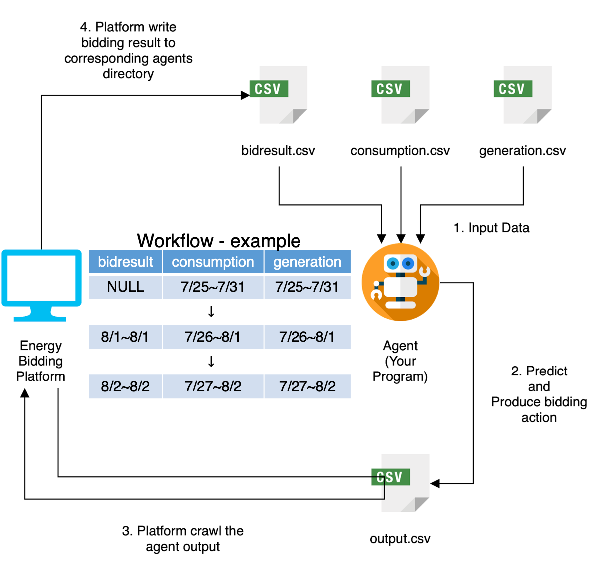
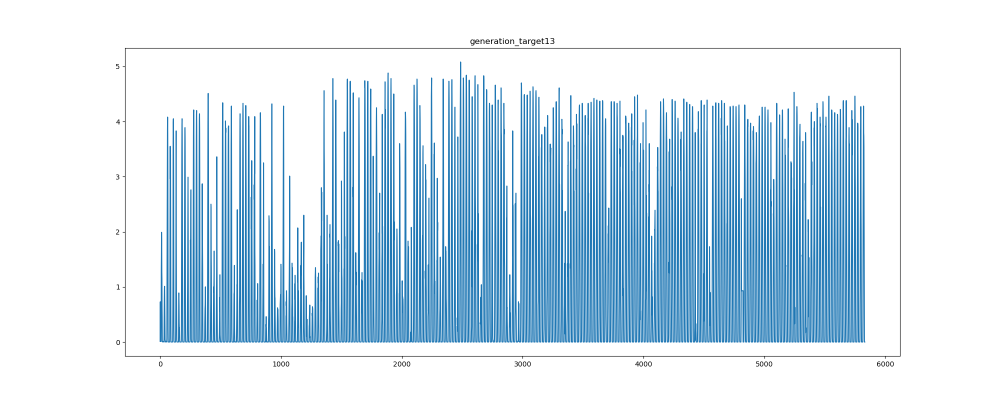
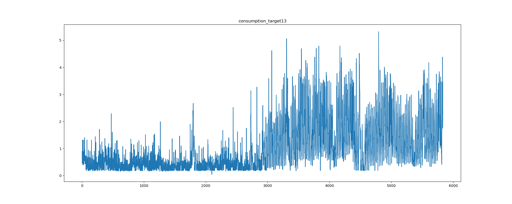
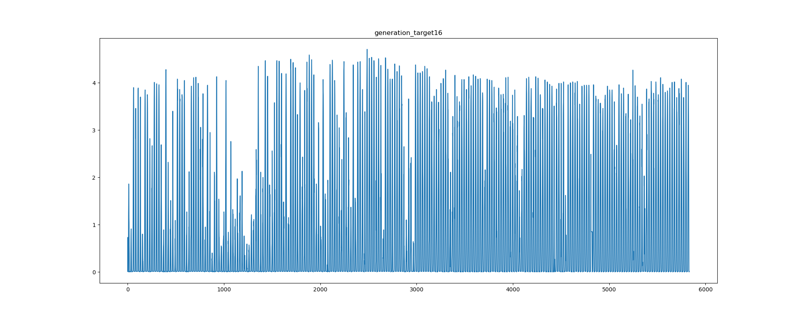
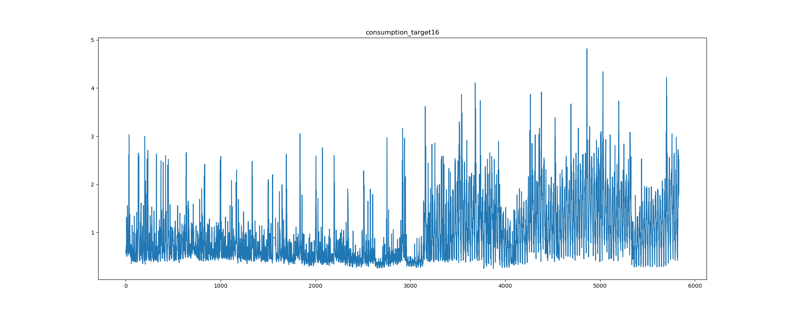
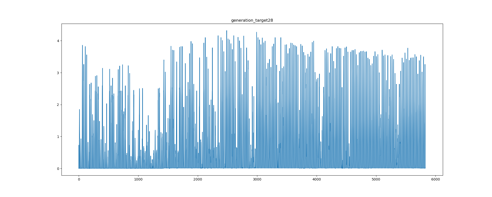
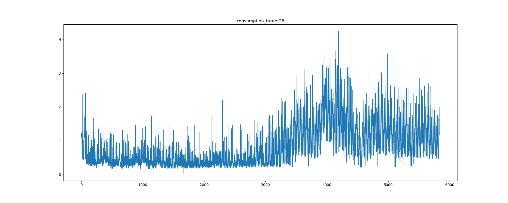
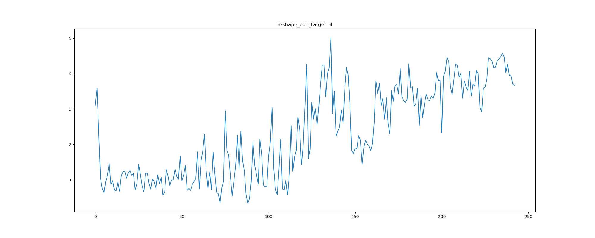
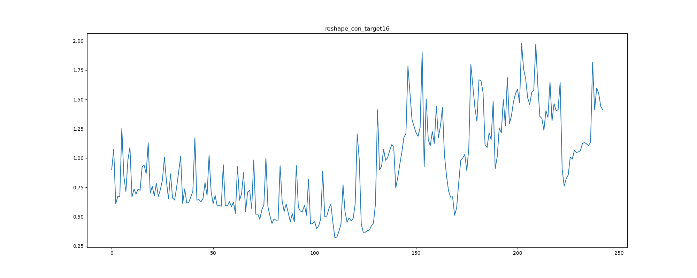
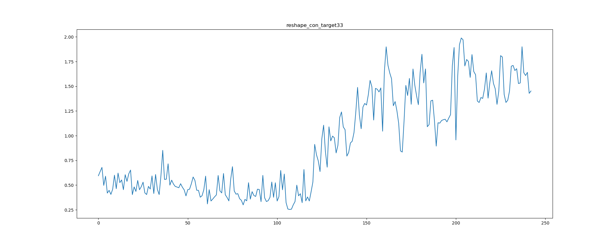

# Energy-Trading

#### DSAI_HW3-Energy-Trading

[Guideline](https://docs.google.com/presentation/d/1ZwXe4xMflCxiDQ7RK6z_LH88r0Dp38sQ/edit#slide=id.p1)

[交易資訊線上表單](https://docs.google.com/spreadsheets/d/1hqoxG48A159buQ-GuoU7Fo-QrGKYmE1DFgPckJR0dFI/edit?usp=sharing)

---

test the code by running 

```python main.py --consumption "Consumption Data" --generation "Generation Data" --bidresult "Bidresult Data" --output output.csv```

---

## 概述（Overview）

* 我所扮演的角色是一個房屋所有者，而我的房子具有電器（例如電燈、冷氣......等等），也具備太陽能發電器。

* 我的房子同時也在一個具有 40 戶的社區微電網中，我可以決定透過電力交易平台購買或出售微電網的電力，也可以依據固定價格購買主電網的電力。

* 目標：設計一個 agent 來進行競標電力，希望最終能使電費最小化。

---

## 資料（Data）

1. 50 households synthetic data
2. Hourly Power consumption (kWh)
3. Hourly Solar Power generation (kWh)
4. Hourly Bidding records
  * 12 months of data
    * 8 months for training [training_data]()
      * target0.csv ~ target49.csv 共 50 筆 csv 檔，每份 header 皆為 time, generation, consumption
    * 1 months for validation
    * 3 months for testing

---

## 輸入與輸出（Input and Output）

* input  
  * consumption.csv
    * 用戶之過去七天的用電資料（每小時一筆），共 168（ 7 * 24 = 168 ）筆
    * | Column Name |            Description             | Unit |
      |:-----------:| :--------------------------------: | :--: |
      |     time    |       Power Consumption Time       |      |
      | consumption | Household power consumption value  |  kWh |
  * generation.csv
    * 用戶之過去七天的產電資料（每小時一筆），共 168（ 7 * 24 = 168 ）筆
    * | Column Name |            Description             | Unit |
      |:-----------:| :--------------------------------: | :--: |
      |     time    |       Power Consumption Time       |      |
      |  generation | Household power consumption value  |  kWh |
  * bidresult.csv
    * 過去七天自己的投標資料
    * 包含詳細的交易結果資訊，第一天的資訊為空，第二天開始會加入前一天的投標資料（如 [workflow.png](https://github.com/Aquarium1222/Energy-Trading/blob/main/workflow.png) 所示）
    * |  Column Name  |                  Description                  | Unit |
      |:-------------:|:---------------------------------------------:|:----:|
      |     time      |           bidding time（目標競標時間）           | hour |
      |    action     |           bidding action (buy／sell)           |      |
      | target_price  |             bidding price (投標價)              | TWD  |
      | target_volume |             bidding volume (投標量)             | kWh  |
      |  trade_price  |  closing price (成交價), -1 when bidding fails  | TWD  |
      | trade_volume  |             closing volume (成交量)             | kWh  |
      |    status     |    bidding result (未成交／完全成交／部分成交）     |      |

* output
  * output.csv
    * 輸出未來一天的時間、決策（買、賣、無競價行動）、目標價格、目標量
    * 同時段可以買賣，但每日最多投標 100 筆
    * |  Column Name  |         Description          | Unit |
      |:-------------:|:----------------------------:|:----:|
      |     time      |   bidding time（目標競標時間）  | hour |
      |    action     |  bidding action（buy／sell）  |      |
      | target_price  |     bidding price（競標價）    | TWD  |
      | target_volume |     bidding volume（競標量）   | kWh  |

---

## 工作流程（Workflow）


* 平台會指定過去七天的資料（cosumption, generation, bidresult）作為參數放進 Agents 程式中
* Agents 會產出未來一天的投標資訊（以小時為單位，意即一天會有 24 筆資料），並可以透過參數指定輸出路徑
* 平台會取得所有 Agents 的投標資訊，並進行媒合
* 平台公告結果並將競標結果寫到各個 Agents 的目錄

---

## 競價行動的類型（Action Type）

* 買
  * 找到一個賣家來購買你的電力，並以目標數量（target_volume）和目標價格（target_price）購買
  * 如果交易成功（成交），買方會獲得對應的交易量（trade_volume）和交易價格

* 賣
  * 以目標數量（target_volume）和目標價格（target_price）尋找買家來購買我所想要賣掉的電力
  * 如果賣方賣給買方的電量不足，賣方就需要向台電購買電量，並以市電單價（market_price）供應給買方
    * 此處的 market_price 為 2.5256

* 無競價行動
  * 在這些時間中，不向 output.csv 輸出任何競價行動

---

## 電費計算（Electricity Bill）

* 總電費計算方式為 A + B
  * A: 從平台 賺／花 的錢
    * a = 買電量 - 賣電量 + 產電量
      * a >= 0: A =（買 - 賣）* 成交價
      * a < 0: A =（-1）* （買 - 賣）* 成交價
  * B: 正常使用電費的錢
    * b = a - 用電量
      * b >= 0: B = 0
      * b < 0: B =（-1）* b * 市電單價

---

## 競價規則（Bidding Rules）

* 同時段可以買賣，每日最多投標 100 筆
* 以小時為單位媒合，格式：%Y-%m-%d %H:%M:%S
* 投標價格與投標量皆以 0.01 為單位（四捨五入）

---

## 分析（Analysis）

* 會影響電費計算之主要因素
  * 自身的電力
    * 用電量
    * 產電量
  * 競價行動
    * 買賣量（volume）
    * 買賣價格（price）

---

## 用電量與產電量（consumption and generation）

* 擁有的[資料集](https://github.com/Aquarium1222/Energy-Trading/tree/main/download/training_data)
  * 包含 target0.csv ~ target49.csv 共 50 筆 csv 檔
  * 每份 csv 檔皆包含 2018/1/1 12:00:00 AM ~ 2018/8/31 11:00:00 PM 的資料（共 5832 筆 = 共 5832 列）
  * 每一列包含產電量與用電量

* 分析產電量與用電量的「每小時」走勢
  * 方法：從[資料集](https://github.com/Aquarium1222/Energy-Trading/tree/main/download/training_data) 中的 50 份 csv 檔案中隨機 sample 三份出來
  * 圖表看法：橫軸為時間、縱軸為電力
    * 左上圖為 target13.csv 中的每小時 generation 走勢（共 5832 筆）
    * 右上圖為 target13.csv 中的每小時 consumption 走勢（共 5832 筆）
    * 左中圖為 target16.csv 中的每小時 generation 走勢（共 5832 筆）
    * 右中圖為 target16.csv 中的每小時 consumption 走勢（共 5832 筆）
    * 左下圖為 target28.csv 中的每小時 generation 走勢（共 5832 筆）
    * 右下圖為 target28.csv 中的每小時 consumption 走勢（共 5832 筆）
  *  
  *  
  *  
  * 發現
    * 時間對 generation 及 consumption 具有一定程度的影響
    * generation 皆在 0 ~ 5 之間劇烈波動
    * consumption 在縱軸 3000 之前皆較低（2018/1/1  12:00:00 AM ~ 2018/5/5 11:00:00 PM）
    * consumption 在縱軸 3000 之後皆較高（2018/5/6 12:00:00 AM ~ 2018/8/31 11:00:00 PM）

* 分析產電量與用電量的「每日平均」走勢
  * 方法：從[資料集](https://github.com/Aquarium1222/Energy-Trading/tree/main/download/training_data) 中的 50 份 csv 檔案中隨機 sample 三份出來
  * 圖表看法：橫軸為時間、縱軸為電力
    * 左上圖為 target13.csv 中的每日平均 generation 走勢（共 5832 筆）
    * 右上圖為 target13.csv 中的每日平均 consumption 走勢（共 5832 筆）
    * 左中圖為 target16.csv 中的每日平均 generation 走勢（共 5832 筆）
    * 右中圖為 target16.csv 中的每日平均 consumption 走勢（共 5832 筆）
    * 左下圖為 target28.csv 中的每日平均 generation 走勢（共 5832 筆）
    * 右下圖為 target28.csv 中的每日平均 consumption 走勢（共 5832 筆）
  *  
  *  
  *  
  * 發現
    * 時間對 generation 及 consumption 具有一定程度的影響
    * generation 的波動差異較大，可能相差到兩倍
      * target14 及 target33 的每日平均走勢大約維持在 0 ~ 0.7
      * target16 的每日平均走勢大約維持在 0 ~ 1.4
    * generation 在縱軸 50 的地方，sample 出來 csv 中，每日平均的走勢皆有明顯下降，或許可以理解為偶爾會遇見陰天，導致大家都產出較少的電力
    * consumption 在縱軸 3000 之前皆較低（2018/1/1 12:00:00 AM ~ 2018/5/5 11:00:00 PM）
    * consumption 在縱軸 3000 之後皆較高（2018/5/6 12:00:00 AM ~ 2018/8/31 11:00:00 PM）

---
## Bidding Auction（競價行為）

* 買賣電力的依據
  * 初步想法
    * 若預測出來的「產電量 < 用電量」，代表電力供不應求，需要買電
    * 若預測出來的「產電量 > 用電量」，代表電力供過於求，可以賣電
  * 問題
    * 預測不可能具有 100% 的準確率，若是超買或是超賣皆會導致虧損
  * 解決方案
    * 設定兩個臨界值（threshold）來控制買賣決策，例如設定買臨界值為 0.3、賣臨界值為 0.6，則意義及買賣行動如下
      * 若預測出來的「產電量 - 用電量 < 0.3」，則買電，而欲買入的電量設定為「用電量 - 產電量 - 0.3」，藉此避免超買
      * 若預測出來的「產電量 - 用電量 > 0.6」，則賣電，而欲賣出的電量設定為「用電量 - 產電量 - 0.6」，藉此避免超賣
    * 例子
      * 買臨界值為 0.3
        * 產電量 = 0.1、用電量 = 0.8，產電量 - 用電量 = 0.1 - 0.8 = -0.7，意即缺少 0.7 單位的電力，但為了避免超買，所以最終只買 0.7 - 0.3 = 0.4 單位的電力
      * 賣臨界值為 0.6
        * 產電量 = 0.8、用電量 = 0.1，產電量 - 用電量 = 0.8 - 0.1 = 0.7，意即多產 0.7 單位的電力，但為了避免超賣，所以最終只買 0.7 - 0.6 = 0.1 單位的電力

* 設定金額的依據
  * 買
    * 出價要夠高才買的到電力，但出價要低於市電單價（Market Price），否則參加競標反而會產生更高的花費
    * 出價要夠低才不會耗費過多不必要的金錢
  * 賣
    * 出價要夠低才能將電力賣掉，至少要低於市電單價（Market Price）才會有人買
    * 出價要夠高才不會少賺太多錢
  * 初步想法
    * 第一天還沒有競標結果（如 workflow 圖所示，第一天為 NULL），所以必須先訂出一個價格（買賣的價格都應低於市電單價），依據為 Online Validation Phase 時的資訊
    * 其餘天數的買賣價格藉由 input 中，過去七天自己的投標資料來決定
    * 若掛上去賣的電力全部賣出，代表可能賣得太便宜，提高金額
    * 若掛上去賣的電力沒有全部賣出，代表可能賣得太昂貴，降低金額
    * 若掛上去買的電力全部買足，代表可能出價太高，降低金額
    * 若掛上去買的電力沒有全部買足，代表可能出價太低，提高金額

---

## 架構（Architecture）

* Method1: 使用 Sequence-to-Sequence (Seq2Seq) 預測產電量及用電量
* Method2: 使用 Long short-term memory (LSTM) 預測產電量及用電量
* Method3: 使用 Moving average (MA) 決定競價金額

